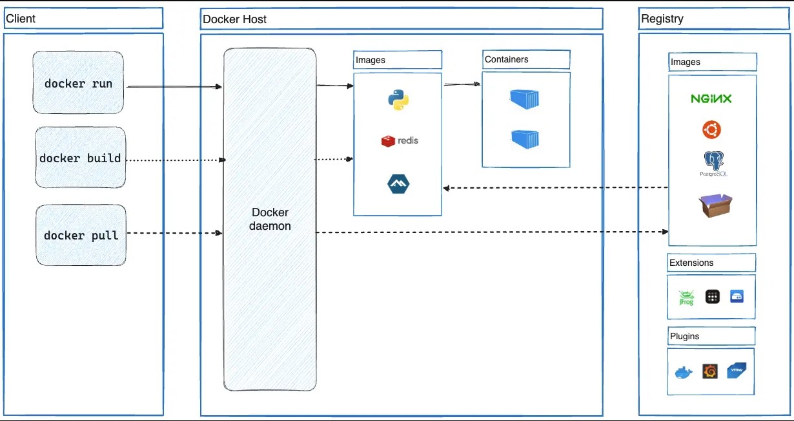
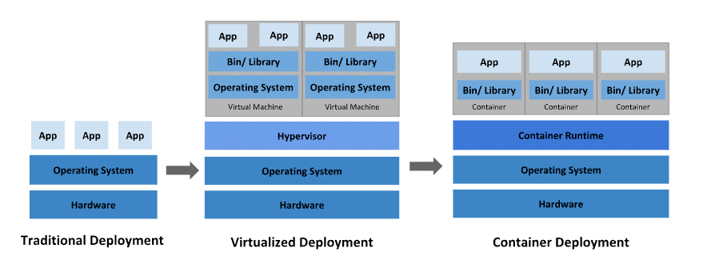
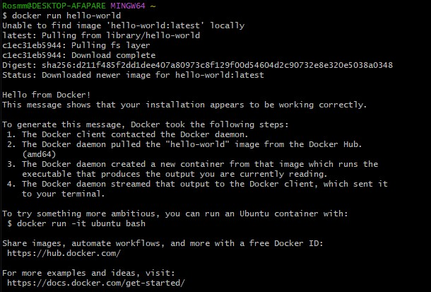
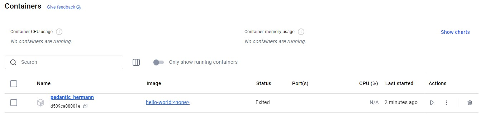
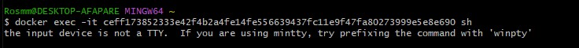
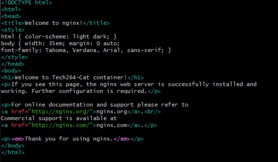

# 🐳 Docker

- [🐳 Docker](#-docker)
  - [Install Docker Desktop](#install-docker-desktop)
  - [Once installed:](#once-installed)
    - [In a terminal window, run docker --version, and paste the output in the chat. From v20 onwards is fine.](#in-a-terminal-window-run-docker---version-and-paste-the-output-in-the-chat-from-v20-onwards-is-fine)
    - [Run Docker Desktop application and check the bottom left for the status.](#run-docker-desktop-application-and-check-the-bottom-left-for-the-status)
    - [Note:](#note)
    - [Create an account on Docker Hub. Doesn't matter the OS you are using on your local machine.](#create-an-account-on-docker-hub-doesnt-matter-the-os-you-are-using-on-your-local-machine)
    - [In Docker Desktop, login using the account you created on Docker Hub.](#in-docker-desktop-login-using-the-account-you-created-on-docker-hub)
- [Task: Research microservices, containers and Docker](#task-research-microservices-containers-and-docker)
    - [Research and document...](#research-and-document)
- [Differences between virtualisation and containerisation](#differences-between-virtualisation-and-containerisation)
    - [What is usually included in a container vs virtual machine?](#what-is-usually-included-in-a-container-vs-virtual-machine)
    - [Benefits of each, especially a virtual machine over the traditional architecture](#benefits-of-each-especially-a-virtual-machine-over-the-traditional-architecture)
- [🏗️ Microservices](#️-microservices)
    - [What are they?](#what-are-they)
    - [How are they made possible?](#how-are-they-made-possible)
    - [Benefits](#benefits)
- [🐳 Docker](#-docker-1)
    - [What is it](#what-is-it)
    - [Alternatives](#alternatives)
    - [How it works (Docker architecture/API)](#how-it-works-docker-architectureapi)
    - [💡 Success story using Docker](#-success-story-using-docker)
- [Docker commands](#docker-commands)
  - [Install the nginx](#install-the-nginx)
  - [Managing Containers](#managing-containers)
  - [Executing Commands Inside a Container](#executing-commands-inside-a-container)
  - [Common Commands Inside the Nginx Container](#common-commands-inside-the-nginx-container)
  - [Running Containers with Different Ports](#running-containers-with-different-ports)
- [Task: Push host-custom-static-webpage container image to Docker Hub](#task-push-host-custom-static-webpage-container-image-to-docker-hub)
- [Task: Automate docker image creation using a Dockerfile](#task-automate-docker-image-creation-using-a-dockerfile)
  - [Step 1: Create a New Directory](#step-1-create-a-new-directory)
  - [Step 2: Create a Custom index.html File](#step-2-create-a-custom-indexhtml-file)
  - [Step 3: Create a Dockerfile](#step-3-create-a-dockerfile)
  - [Step 4: Build the Docker Image](#step-4-build-the-docker-image)
  - [Step 5: Run the Custom Container](#step-5-run-the-custom-container)
  - [Step 6: Push the Image to Docker Hub](#step-6-push-the-image-to-docker-hub)
  - [Step 7: Run the Custom Image from Docker Hub](#step-7-run-the-custom-image-from-docker-hub)
  - [Step 8: Clean Up and Re-run from Docker Hub](#step-8-clean-up-and-re-run-from-docker-hub)



## Install Docker Desktop
https://www.docker.com/products/docker-desktop/

## Once installed:
### In a terminal window, run docker --version, and paste the output in the chat. From v20 onwards is fine.

```bash
docker --version
# Docker version 27.2.0, build 3ab4256
```

### Run Docker Desktop application and check the bottom left for the status.
### Note:
- Status should be green and the newer versions also state "Engine running".
- If the status is not green, you will need to troubleshoot to get it running.
:warning: Warning! When starting Docker Desktop in Windows, you will likely need to choose to "Run as Administrator". If you don't, you will get an error.

    

### Create an account on Docker Hub. Doesn't matter the OS you are using on your local machine.
### In Docker Desktop, login using the account you created on Docker Hub.


# Task: Research microservices, containers and Docker

### Research and document...

# Differences between virtualisation and containerisation

1. 🖥️ **Virtualization**:

    - Virtualization is the process of creating multiple simulated environments (virtual machines) on a single physical machine using a hypervisor.
    - Each virtual machine (VM) has its own operating system (guest OS) and resources, independent of the host OS.

2. 📦 **Containerization**:

    - Containerization involves creating isolated environments (containers) on a shared operating system. Containers share the host OS kernel and are more lightweight than VMs.
    - Containers package applications with their dependencies but do not include a full OS, making them faster to deploy and consume fewer resources.

3. ⚖️ **Key Differences**:

    - **OS Requirements**: VMs require a full OS per VM, while containers share the host OS.
    - **Resource Efficiency**: Containers are more lightweight and resource-efficient than VMs.
    - **Isolation**: VMs provide stronger isolation as each VM runs its OS, whereas containers share the host OS, potentially reducing isolation.

### What is usually included in a container vs virtual machine?

1. **Container**:

    - Application code and binaries
    - Libraries and dependencies specific to the application
    - Shared OS kernel with the host (no separate OS for each container)

2. **Virtual Machine (VM)**:

    - Application code and binaries
    - Full guest OS (including its own kernel, libraries, and dependencies)
    - Hardware resources are virtualized (CPU, memory, storage, and network interface)

### Benefits of each, especially a virtual machine over the traditional architecture

1. **Virtualization Benefits**:

    - 🛡️ **Strong Isolation**/**security**: Each VM runs its OS, offering robust security and isolation.
    - 📋 **Compatibility**: VMs can run different OSes on the same hardware, making it ideal for running legacy or different applications.
    - ⚙️ **Scalability and Flexibility**: Virtualized environments can be scaled horizontally and vertically, adapting to workload requirements.

2. **Containerization Benefits**:

    - 💽 **Resource Efficiency**: Containers are lightweight and start quickly, allowing high-density application deployment.
    - 🌍 **Portability**: Containers include all dependencies, making applications portable across environments (e.g., from development to production).
    - ⚡ **Fast Scaling and Deployment**: Containers can be spun up or down quickly, making them ideal for microservices and agile environments.

# 🏗️ Microservices
### What are they?
- Microservices is an architectural style where an application is built as a collection of loosely coupled, independent services, each responsible for a specific business functionality.

### How are they made possible?
- 📦 **Containers**: **Most important**  such as those created with Docker, enable isolated, lightweight, and easily scalable environments for each microservice.
- 📡 **APIs**: Microservices architecture relies on APIs for communication between services.
- 🚀 **DevOps and CI/CD** : DevOps practices, continuous integration/continuous deployment (CI/CD), and orchestration tools like Kubernetes support the management and deployment of microservices.
  
### Benefits
- 📈 **Scalability**: Services can be scaled independently, allowing resources to be allocated based on each service’s demand.
- 🔄 **Flexibility in Development**: Teams can work on different services simultaneously and in different languages.
- 🛡️ **Resilience**: Failure in one microservice doesn’t bring down the whole application, enhancing fault tolerance.
- 🚢 **Ease of Deployment**: Microservices allow for continuous deployment as services can be updated independently.


# 🐳 Docker

###  What is it
- Docker is an open-source platform for developing, shipping, and running applications in containers. Docker allows applications to run consistently across different environments.

###  Alternatives
- 🐧 **Podman**: Docker-compatible container engine that can run without a daemon, ideal for rootless containers.
- ☸️ **Kubernetes** (with CRI-O or Containerd): While primarily an orchestration tool, Kubernetes supports container engines like CRI-O and Containerd.
- 📦 **LXC/LXD**: Linux Containers offer system containers with full OS, closer to lightweight VMs.
- 🛡️**rkt**(Rocket): A container runtime focused on security, though development is now discontinued.

###  How it works (Docker architecture/API)
- 🖥️ **Docker Engine**: Core component that runs on the host OS to create and manage containers.
- 🔧 **Docker Daemon**: The background service that manages Docker objects (images, containers, networks).
- 💻 **Docker CLI**: Command-line interface to interact with Docker Daemon for executing commands (e.g., docker run).
- 🖼️ **Docker Images**: A blueprint for containers, containing application code and dependencies.
- 📂 **Docker Containers**: Instances created from Docker images.
- 🌐**Docker Registry**: Centralized repository (like Docker Hub) to store and share Docker images.
- 📡**Docker API**: Provides an interface for interacting with the Docker daemon programmatically, enabling automation.

### 💡 Success story using Docker
- **ADP (Automatic Data Processing)**: ADP migrated to a microservices architecture powered by Docker containers to modernize its application deployment. Docker allowed ADP to deploy new features faster, isolate applications, and improve infrastructure efficiency. This move to Docker helped ADP achieve significant savings in time and resources while improving scalability and resilience in production environments.



# Docker commands
- Show Docker Commands Help: 
    ```bash
    docker --help
    ```
- List Docker Images:
    ```bash
    docker images
    ```
- Run a Test Container:
  - The first time you run this command, Docker will pull the image if it doesn’t exist locally.
    ```bash
    docker run hello-world
    ```

    

    - chacked image in the docker hub 
  
        

- Check Running Containers:
    ```bash
    docker ps
    ```
    -  To view all containers, including stopped ones:
        ```bash
        docker ps -a
        ```
    - For more options with ps:   
        ```bash
        docker ps --help
        ```

## Install the nginx 
1. Run an Nginx Container:
    ```bash
    docker run -d -p 80:80 nginx
    # -d -> run in the background ( detached mode)
    # -p -> port 
    # 80:80 define the inside and outside port of container
    ```
    - if you dont specify **nginx tag** -> will go and get the **latest** one ( **nginx:latest**)

        


2. Verify Nginx:
   -  to check it working we go to browser and type either :
      -  **localhost**
      -  **127.0.0.1**


## Managing Containers
- Stop a container
    ```bash
    docker stop <name of container/od>
    ```

- Show all containers(include the stopped containers)
    ```bash
    docker ps -a
    ```

- Start a container
    ```bash
    docker start <container name/id>
    ```

- Remove a container(force remove)
    ```bash
    docker rm -f <container name/id>
    ```

## Executing Commands Inside a Container
- Run commands inside the container
    ```bash
    docker exec -it <container name/id> sh
    # This opens an interactive shell inside the container.
    # If you see the prompt #, it means you're inside the container.
    ```

    

- Setting Up Alias for Compatibility (if you're using Docker on Windows):
    ```bash
    alias docker="winpty docker"
    ```

## Common Commands Inside the Nginx Container
- Basic System Information:
    ```bash
    uname       # Displays system information
    uname -a    # Displays all system information
    ```

- Updating and Installing Tools:
    ```bash
    apt-get update -y      # Updates the package list
    apt-get upgrade -y     # Upgrades installed packages
    apt-get install sudo   # Installs sudo if needed
    apt-get install nano   # Installs nano text editor

    ```

- Modifying the Nginx Default Page(change front page inside the container):
    ```bash
    pwd
    ```
    ```bash
    cd usr
    ```
    ```bash
    cd share
    ```
    ```bash
    cd nginx
    ```
    ```bash
    cd html
    ```
    - Full path 
        ```bash
        cd /usr/share/nginx/html
        ```
    - Edit the index.html file 
        ```bash
        nano index.html
        ```

        


    - Exit the Container
        ```bash
        exit 
        ```


## Running Containers with Different Ports
- Run Nginx on Default Port 80:
    ```bash
    docker run -d -p 80:80 <your_dockerhub_username>/nginx
    ```

    

- Run Nginx on a Different Host Port
    ```bash
    docker run -d -p 90:80 ahskhan/nginx-254
    # example
    ```
    - Now, you can access this container by visiting **localhost:90** in your browser.


# Task: Push host-custom-static-webpage container image to Docker Hub

-  Create an image from your running container which is running nginx with the index.html file we already modified in our code-along
     1. **commit the running container to an image** 
        ```bash
        docker commit ceff17385233 corinnai/nginx-264
        #sha256:f1b3828a57131529c74db3b36465b40f230452e12df4ec290dd013458cc0a8cd
        ```
    2. **push the Image to Docker Hub**
        - Log in to your Docker Hub
            ```bash
            docker login
            ```
        - push the image
            ```bash
            docker push your_dockerhub_username/nginx-modified
            ```

    3.  **test the Image by Running It from Docker Hub**
        - delete the local image:
            ```bash
            docker rmi your_dockerhub_username/nginx-modified
            ```
        - run the image from Docker Hub
            ```bash
            docker run -d -p 81:80 corinnai/nginx-264
            #changed 80:80 with 81:80 as the post 8- was already on use
            ```
        - verify the images 
            ```bash
            docker images
            ```

    4. **verify it’s working**:
        - open a browser and go to 
            - **localhost:81**


# Task: Automate docker image creation using a Dockerfile
We don't want to do the steps manually to change the default nginx page. We want to automate it.
You are also practicing using the docker build command

- Create a new folder such as tech2xx-mod-nginx-dockerfile (not in a repo that will be published)
- cd into the new folder
- Create an index.html you'd like to use instead of the nginx default page
- Create a Dockerfile to:
    - Use the nginx base image
    - Copy your index.html to the location of the nginx default page in the container
- Use docker build command to build your custom image
    - Tag it similar to tech2xx-nginx-auto:v1
- Run the container
- Push your custom image to Docker Hub
- Share your command to run your custom image in the chat

If time:
- Remove the local copy of your custom image
- Re-run your container and force docker to pull the custom image from Docker Hub


## Step 1: Create a New Directory
1. Open your terminal
```bash
mkdir tech264-mod-nginx-dockerfile
```
2. Navigate into the new folder
```bash
cd tech264-mod-nginx-dockerfile
```

## Step 2: Create a Custom index.html File
1. index.html
```html
<!-- index.html -->
<!DOCTYPE html>
<html lang="en">
<head>
    <meta charset="UTF-8">
    <title>Custom Nginx Page</title>
</head>
<body>
    <h1>Welcome to My Custom Nginx Page!</h1>
    <p>This page has been automated using Dockerfile.</p>
</body>
</html>
```

2. Save this file in the tech2xx-mod-nginx-dockerfile directory.
   
## Step 3: Create a Dockerfile

1. Dockerfile
```dockerfile
# Use the nginx base image
FROM nginx:latest

# Copy the custom index.html to the default nginx html directory
COPY index.html /usr/share/nginx/html/index.html

```
## Step 4: Build the Docker Image
1. docker build command
    ```bash
    docker build -t tech2xx-nginx-auto:v1 .
    ```
    - `-t` tags the image with a name `(tech264-nginx-auto)` and version `(v1)`.
    - `.` indicates the current directory as the build context.
  

  docker build -t tech264-nginx-auto:v1 .

## Step 5: Run the Custom Container
1. Run the container
    ```bash
    docker run -d -p 80:80 tech2xx-nginx-auto:v1
    ```
2. Verify the custom page by visiting `http://localhost` or `http://127.0.0.1` in your browser.

## Step 6: Push the Image to Docker Hub

1. Log in to Docker Hub
    ```bash
    docker login
    ```

2. Tag the image
    ```bash
    docker tag tech264-nginx-auto:v1 your_dockerhub_username/tech264-nginx-auto:v1
    ```

3. Push the image
   ```bash
   docker push your_dockerhub_username/tech264-nginx-auto:v1
   ```

## Step 7: Run the Custom Image from Docker Hub
```bash
docker run -d -p 80:80 your_dockerhub_username/tech264-nginx-auto:v1
```

## Step 8: Clean Up and Re-run from Docker Hub
1. Remove the local image
    ```bash
    docker rmi tech264-nginx-auto:v1
    ```
2. Re-run the container to pull it from Docker Hub
    ```bash
    docker run -d -p 80:80 your_dockerhub_username/tech264-nginx-auto:v1
    ```